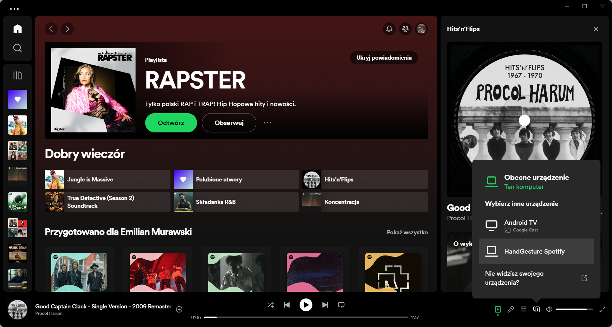

# HandGesture-Spotify App

Authors: Łukasz Kos, Emilian Murawski

HandGesture-Spotify is a web application that enables users to control Spotify playback using hand gestures captured 
via a webcam. The app utilizes the MediaPipe library for hand gesture recognition and integrates with the Spotify API 
for music playback control. It uses an Express backend for authentication, ensuring a secure and seamless connection to 
your Spotify account and React frontend for convenient usage.

For more info of 


## Features

- Play and pause music with a raised index finger gesture.
- Stop music with a closed fist gesture.
- Skip to the next track with a thumb-up gesture.
- Go back to the previous track with a thumb-down gesture.

## Prerequisites

Before running the application, make sure you have the following installed:

- Node.js
- npm (Node Package Manager)

## Getting Started

1. Clone the repository:

   ```bash
   git clone https://github.com/s22051-pj-lukasz-kos/Quarto.git
    ```
2. Change active directory to project root:

    ```bash
   cd lab6-ComputerVision
   ```
3. Install required dependencies using npm:

   ```bash
   npm install
   ```
4. Build project:

   ```bash
   npm run build
   ```
5. Run both backend and frontend apps:
   ```bash
   npm run dev
   ```
6. Go to web browser [http://localhost:3000/](http://localhost:3000/)


7. Log in to your Spotify account


8. Open your Spotify instance on PC or smartphone and connect to your instance
   


9. Click enable predicitons, allow app to use camera and enjoy :)